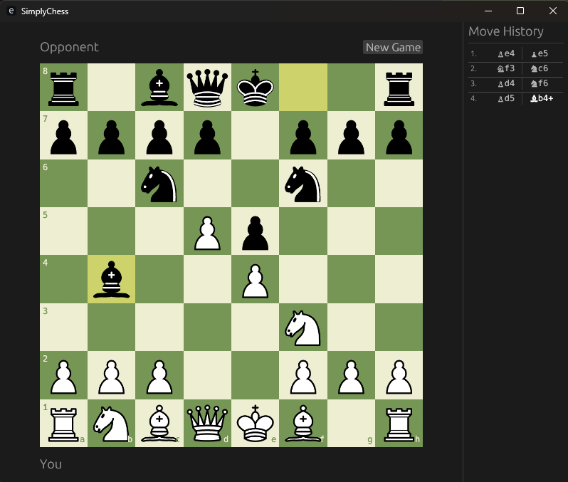

# SimplyChess

A simple chess game built with Rust and EGUI.



## Overview

SimplyChess is a functional chess implementation written in Rust. The project uses EGUI for the graphical interface, providing a responsive and intuitive chess-playing experience.

## Features

- Complete chess rules implementation including:
  - All piece movements (pawns, knights, bishops, rooks, queens, kings)
  - Special moves (castling, en passant)
  - Pawn promotion with piece selection UI
  - Check and checkmate detection
  - Stalemate detection
- Interactive graphical interface with:
  - Click and drag piece movement
  - Valid move highlighting
  - Move history display
  - Last move highlighting
- Game state management:
  - New game option
  - Game over screens for checkmate and stalemate

## Project Structure

The project is organized into two main crates:

- **chess-core**: Contains the core chess logic, including board representation, move validation, and game state management
- **chess-gui**: Handles the graphical interface using EGUI, including rendering, user input, and piece assets

## Dependencies

### Core Dependencies
- **egui** (0.33): Immediate mode GUI framework for creating the chess interface
- **eframe** (0.33): Framework for running egui applications natively

### Asset Processing
- **resvg** (0.46): SVG rendering library for converting chess piece SVG files to textures
- **usvg** (0.46): SVG parser used by resvg for processing piece graphics
- **tiny-skia** (0.11): 2D graphics library used for rendering SVG assets

## Installation and Running

### Prerequisites
- Rust toolchain (1.70 or later recommended)
- Cargo package manager

### Building from Source

```bash
# Clone the repository
git clone https://github.com/yourusername/rust_chess.git
cd rust_chess

# Build the project
cargo build --release

# Run the game
cargo run --release
```

### Development Build

```bash
cargo run
```

## Future Ideas

### Planned Features
- **AI Opponent**: Implement computer player with adjustable difficulty levels using minimax algorithm with alpha-beta pruning
- **Additional Draw Conditions**: 
  - Threefold repetition detection
  - Fifty-move rule
  - Insufficient material detection
- **Move Validation Enhancements**:
  - Algebraic notation improvements
  - Move disambiguation for identical pieces
- **UI Improvements**:
  - Board themes and customization options
  - Piece set selection
  - Sound effects for moves and captures
  - Animation for piece movements
- **Game Features**:
  - Save/load game functionality (PGN format support)
  - Game analysis mode
  - Takeback/undo moves
  - Clock/timer support for timed games
- **Multiplayer**:
  - Network play support
  - Online matchmaking

### Technical Improvements
- Performance optimizations for move generation
- Bitboard representation for faster position evaluation
- Opening book integration
- Position evaluation metrics display


## License

This project is licensed under the MIT License - see the LICENSE file for details.

## Acknowledgments

- Chess piece SVG graphics from standard chess iconography
- EGUI framework for providing an excellent immediate mode GUI library
- The Rust community for comprehensive documentation and support
